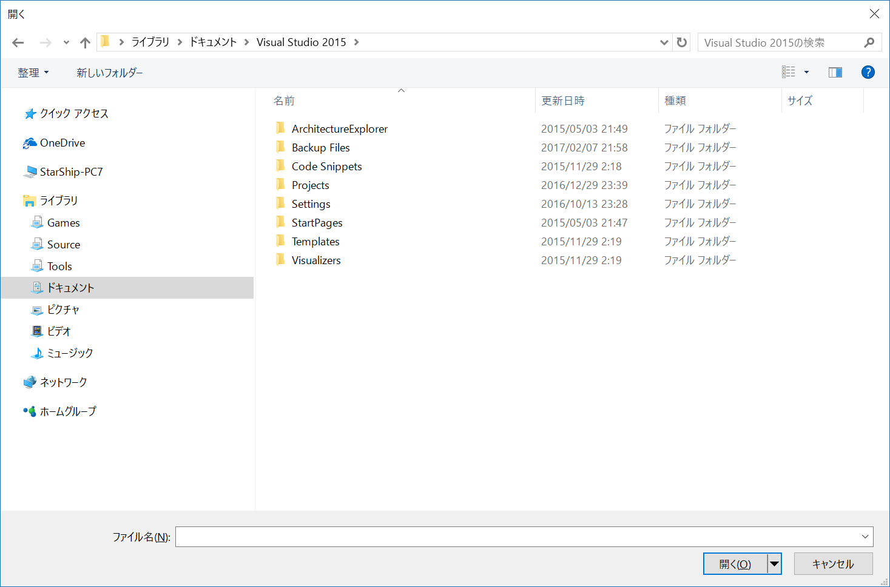
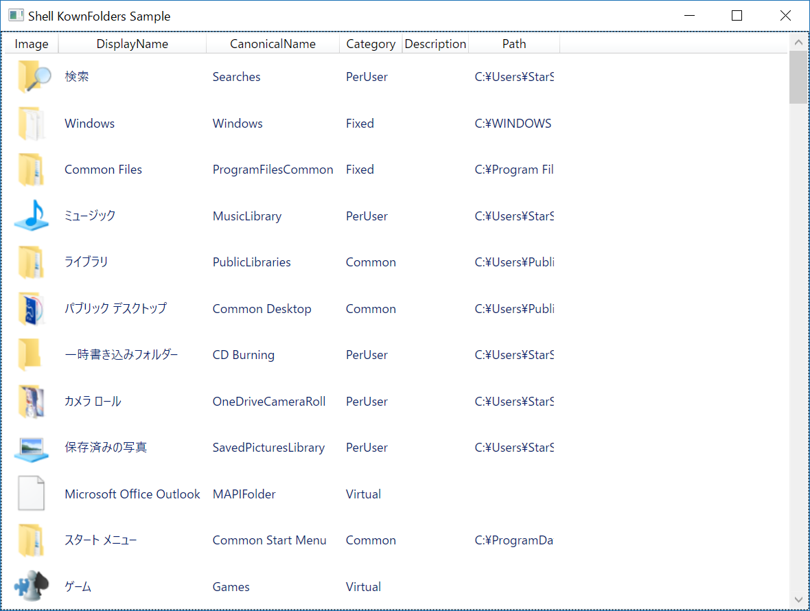

[English](README.md)

starshipxac.ShellLibrary
==========================

Windowsの [Shell API](https://msdn.microsoft.com/en-us/library/windows/desktop/ee663298) , IFileDialogなどを .NETFrameworkで使用できるライブラリです。

動作環境:

- Windows7/8.1/10
- .NETFramework4.5以上

## ライブラリ

### starshipxac.Shell

- `ShellFile`: ファイルの情報を保持します。
- `ShellFolder`: フォルダーの情報を保持します。
- `ShellLibrary`: Windows7より使用できる「ライブラリフォルダー」の情報を保持します。
- `ShellKnownFolder`: デスクトップ、ドキュメント、ダウンロードなどの標準フォルダーの情報を保持します。

### starshipxac.Shell.Windows

- starshipxac.Shell.Windows.Dialogs
  - `OpenFileSelector`: 開くファイルを選択するダイアログ。
    
  - `SaveFileSelector`: 保存するファイルを選択するダイアログ。
  - `FolderSelector`: フォルダーを選択するダイアログ。
- starshipxac.Shell.Media.Imaging
  - `ShellThumbnail`: ファイルやフォルダーのアイコン/サムネイル画像を取得します。
    

## サンプル

### ShellExplorerSample

フォルダーのツリー表示と、フォルダー内のアイテム一覧表示。

### ShellFileDialogSample

ファイルを開く、名前をつけて保存、フォルダー選択およびカスタムファイルダイアログの表示。

### ShellKnownFoldersSample

標準フォルダーの一覧。
